# Universal Knowledge Platform - C4 Model Architecture

## Level 1: System Context Diagram

```mermaid
graph TB
    User[👤 End User] --> ALB[🌐 Application Load Balancer]
    Admin[👨‍💼 System Administrator] --> ALB
    API[🔌 External APIs] --> ALB
    
    ALB --> UKP[🏢 Universal Knowledge Platform]
    
    UKP --> DB[(🗄️ PostgreSQL Database)]
    UKP --> Cache[(⚡ Redis Cache)]
    UKP --> Search[(🔍 Elasticsearch)]
    UKP --> Storage[(📦 S3 Storage)]
    
    subgraph "AWS Cloud"
        UKP
        DB
        Cache
        Search
        Storage
    end
```



## Level 2: Container Diagram

```mermaid
graph TB
    User[👤 End User] --> ALB[🌐 Application Load Balancer]
    
    ALB --> API[🚀 API Gateway]
    ALB --> Web[🌐 Web Application]
    
    API --> Auth[🔐 Authentication Service]
    API --> Query[🔍 Query Processing Service]
    API --> Content[📄 Content Management Service]
    API --> Search[🔎 Search Service]
    
    Query --> Orchestrator[🎭 Lead Orchestrator]
    Orchestrator --> Retrieval[📚 Retrieval Agent]
    Orchestrator --> FactCheck[✅ Fact Check Agent]
    Orchestrator --> Synthesis[🧠 Synthesis Agent]
    Orchestrator --> Citation[📝 Citation Agent]
    
    Auth --> DB[(🗄️ PostgreSQL)]
    Content --> DB
    Search --> ES[(🔍 Elasticsearch)]
    Cache --> Redis[(⚡ Redis)]
    
    subgraph "Kubernetes Cluster"
        API
        Auth
        Query
        Content
        Search
        Orchestrator
        Retrieval
        FactCheck
        Synthesis
        Citation
    end
```



## Level 3: Component Diagram

### API Gateway Component

```mermaid
graph TB
    Request[📥 HTTP Request] --> Router[🛣️ Request Router]
    
    Router --> AuthMiddleware[🔐 Authentication Middleware]
    Router --> RateLimit[⏱️ Rate Limiting]
    Router --> Logging[📝 Request Logging]
    
    AuthMiddleware --> AuthService[🔐 Auth Service]
    RateLimit --> Cache[(⚡ Redis)]
    Logging --> Monitoring[📊 Monitoring Service]
    
    Router --> HealthCheck[🏥 Health Check]
    Router --> Metrics[📈 Metrics Endpoint]
    Router --> API[🔌 API Endpoints]
    
    API --> QueryProcessor[🔍 Query Processor]
    API --> AgentManager[🤖 Agent Manager]
    API --> ResponseFormatter[📤 Response Formatter]
```



### Lead Orchestrator Component

```mermaid
graph TB
    Query[📝 User Query] --> Orchestrator[🎭 Lead Orchestrator]
    
    Orchestrator --> QueryAnalyzer[🔍 Query Analyzer]
    Orchestrator --> AgentSelector[🤖 Agent Selector]
    Orchestrator --> WorkflowEngine[⚙️ Workflow Engine]
    Orchestrator --> ResultAggregator[📊 Result Aggregator]
    
    QueryAnalyzer --> IntentClassifier[🎯 Intent Classifier]
    QueryAnalyzer --> EntityExtractor[🏷️ Entity Extractor]
    
    AgentSelector --> RetrievalAgent[📚 Retrieval Agent]
    AgentSelector --> FactCheckAgent[✅ Fact Check Agent]
    AgentSelector --> SynthesisAgent[🧠 Synthesis Agent]
    AgentSelector --> CitationAgent[📝 Citation Agent]
    
    WorkflowEngine --> Pipeline[🔗 Agent Pipeline]
    WorkflowEngine --> Cache[(⚡ Cache)]
    WorkflowEngine --> Monitoring[📊 Monitoring]
    
    ResultAggregator --> ConfidenceScorer[📊 Confidence Scorer]
    ResultAggregator --> CitationGenerator[📝 Citation Generator]
    ResultAggregator --> ResponseFormatter[📤 Response Formatter]
```



## Level 4: Code Diagram

### Agent Interface

```python
# Core agent interface
class BaseAgent:
    async def process(self, context: QueryContext) -> AgentResult
    async def validate_input(self, context: QueryContext) -> bool
    async def generate_response(self, context: QueryContext) -> AgentResult
    async def calculate_confidence(self, result: AgentResult) -> float

# Specific agent implementations
class RetrievalAgent(BaseAgent):
    async def hybrid_search(self, query: str) -> List[Document]
    async def semantic_search(self, query: str) -> List[Document]
    async def keyword_search(self, query: str) -> List[Document]

class FactCheckAgent(BaseAgent):
    async def verify_claims(self, claims: List[str]) -> List[ClaimResult]
    async def cross_reference(self, claim: str) -> List[Source]
    async def calculate_veracity(self, claim: str) -> float

class SynthesisAgent(BaseAgent):
    async def generate_answer(self, context: QueryContext) -> str
    async def integrate_sources(self, sources: List[Document]) -> str
    async def assess_confidence(self, answer: str) -> float

class CitationAgent(BaseAgent):
    async def generate_citations(self, sources: List[Document]) -> List[Citation]
    async def format_citation(self, citation: Citation, format: str) -> str
    async def validate_source(self, source: Document) -> bool
```

### Data Flow


## Technology Stack

### Infrastructure Layer
- **Cloud Provider**: AWS
- **Container Orchestration**: Kubernetes (EKS)
- **Load Balancer**: Application Load Balancer
- **Database**: PostgreSQL (RDS)
- **Cache**: Redis (ElastiCache)
- **Search**: Elasticsearch
- **Storage**: S3
- **Monitoring**: Prometheus + Grafana

### Application Layer
- **API Framework**: FastAPI
- **Language**: Python 3.11+
- **Async Runtime**: asyncio
- **HTTP Client**: aiohttp
- **Serialization**: Pydantic

### AI/ML Layer
- **Vector Embeddings**: sentence-transformers
- **Language Models**: OpenAI GPT, Anthropic Claude
- **Search**: Elasticsearch with k-NN
- **Caching**: Redis with semantic caching

### Development Tools
- **Version Control**: Git
- **CI/CD**: GitHub Actions
- **Infrastructure as Code**: Terraform
- **Containerization**: Docker
- **Testing**: pytest
- **Linting**: flake8, black, mypy

## Security Architecture

### Authentication & Authorization
- **JWT Tokens**: Stateless authentication
- **RBAC**: Role-based access control
- **API Keys**: For external integrations
- **Rate Limiting**: Per-user and per-endpoint

### Data Protection
- **Encryption at Rest**: AES-256 for databases
- **Encryption in Transit**: TLS 1.3 for all connections
- **Secrets Management**: AWS Secrets Manager
- **Data Masking**: PII protection

### Network Security
- **VPC**: Isolated network environment
- **Security Groups**: Firewall rules
- **WAF**: Web Application Firewall
- **DDoS Protection**: AWS Shield

## Scalability Architecture

### Horizontal Scaling
- **Auto-scaling**: Kubernetes HPA
- **Load Distribution**: ALB with health checks
- **Database Scaling**: Read replicas
- **Cache Scaling**: Redis cluster

### Performance Optimization
- **Caching**: Multi-level caching strategy
- **CDN**: CloudFront for static content
- **Database Optimization**: Connection pooling
- **Async Processing**: Background tasks

## Monitoring & Observability

### Metrics Collection
- **Application Metrics**: Custom Prometheus metrics
- **Infrastructure Metrics**: CloudWatch
- **Business Metrics**: Custom dashboards
- **Performance Metrics**: APM with tracing

### Alerting
- **Critical Alerts**: Service down, high error rates
- **Performance Alerts**: High latency, low throughput
- **Business Alerts**: Query volume, success rates
- **Security Alerts**: Unusual access patterns

### Logging
- **Structured Logging**: JSON format
- **Log Aggregation**: CloudWatch Logs
- **Log Analysis**: ELK stack
- **Audit Logging**: Security events

## Deployment Architecture

### Environment Strategy
- **Development**: Local Docker Compose
- **Staging**: AWS with test data
- **Production**: AWS with full monitoring

### Deployment Pipeline
- **Code Review**: Pull request workflow
- **Automated Testing**: Unit, integration, performance
- **Security Scanning**: SAST, DAST, container scanning
- **Deployment**: Blue-green deployment
- **Rollback**: Automated rollback capability

### Configuration Management
- **Environment Variables**: 12-factor app principles
- **Secrets**: AWS Secrets Manager
- **Feature Flags**: Dynamic configuration
- **Database Migrations**: Version-controlled schema changes 